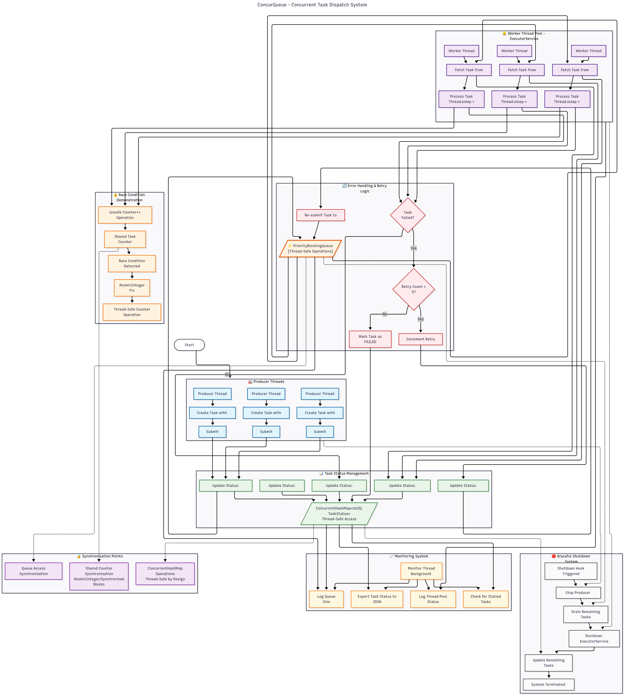

# 🚀 ConcurQueue – A Multithreaded Job Processing Platform

A high-performance, Java-based concurrent job dispatching system designed to simulate real-world task submission and processing using multithreading, synchronization primitives, and executor services.

> 🧪 Built as part of Lab Work 4 for the Advanced Java Concurrency module at NovaTech Solutions.

---

## 📝 Project Summary

ConcurQueue is a fully functional, concurrent task dispatch platform featuring:

- Multiple **producer threads** that submit jobs with varying priorities.
- A **thread pool of workers** that concurrently process tasks from a shared blocking queue.
- A **monitoring system** that tracks queue state, thread activity, and system health.
- Robust handling of concurrency issues like **race conditions** and **deadlocks**.
- Support for **task retry**, **graceful shutdown**, and **status tracking**.

---
🗂️ Project Structure
```bash
src/
├── model/                # Task, TaskStatus enums
├── producers/            # Producer threads
├── consumers/            # Worker threads using ExecutorService
├── core/                 # TaskQueueManager, MonitorService
├── utils/                # Logger, RetryHandler, ShutdownHook
└── Main.java             # Bootstrap class
```

---

## 🧱 System Architecture

### ✳️ Task Model

Each task includes:

- `UUID id`
- `String name`
- `int priority`
- `Instant createdTimestamp`
- `String payload`

Tasks are prioritized using a `PriorityBlockingQueue`, enabling high-priority jobs to be processed first. A `Comparable` implementation ensures correct ordering.

---

### 👨‍🏭 Producer Threads

- Three producer threads simulate different clients.
- Each periodically submits tasks with randomized priorities.
- Submission intervals and payloads are varied to reflect real-world conditions.

---

### 🧵 Worker Pool (Consumers)

- Implemented using `ExecutorService` with a fixed thread pool.
- Workers continuously poll tasks from the shared queue and simulate execution with delays.
- All task processing events (start, end, thread info) are logged to the console.

---

### 📦 Queue & Task Tracking

- A thread-safe `PriorityBlockingQueue` is used for job storage.
- `ConcurrentHashMap<UUID, TaskStatus>` tracks the lifecycle of each task:
    - `SUBMITTED`
    - `PROCESSING`
    - `COMPLETED`
    - `FAILED`
- A bounded queue variant (optional) blocks producers when the queue is full.

---

### 📊 Monitoring & Logging

A dedicated **Monitor Thread** runs in the background:

- Logs queue size and worker thread stats every 5 seconds.
- Detects and logs long-running or stuck tasks.

---

### 🔁 Retry & Shutdown

- Failed tasks are retried **up to 3 times**.
- A **shutdown hook** gracefully:
    - Stops producers
    - Waits for consumers to finish
    - Drains the queue before shutdown

---

## 🔐 Concurrency Challenges Solved

### ⚠️ Race Condition Demo

A shared counter (`taskProcessedCount`) was initially accessed unsafely to simulate a race condition. This was then resolved using:

- `AtomicInteger`
- and `synchronized` blocks

### 🧱 Deadlock Scenario

A simple deadlock was intentionally introduced using two locks with inverted acquisition order. The resolution used:

- **Lock ordering discipline**
- or **`tryLock` with timeout** as an alternative

---
## 🎥 Demo 
### [VideoLink](VideoLink)

---
## 📈 Activity Diagram


---
## 🧰 How to Run

### 🛠️ Prerequisites

- Java 17+
- Maven

### ▶️ Running the Project

```bash
git clone https://github.com/Ganza-Kevin-Murinda/ConcurQueue-System.git
cd ConcurQueue
# Build the project
mvn install
```
## 👨‍💻 Author
> Ganza Kevin Murinda

#### ©️ Advanced Java Concurrency – Lab 4


